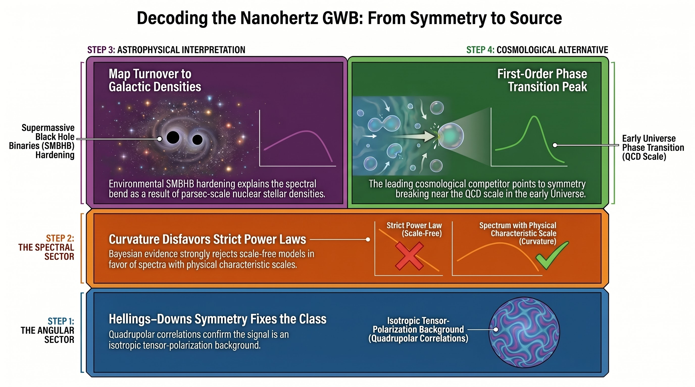

# Bayesian evidence for the nanohertz gravitational-wave background

[](https://doi.org/10.3390/sym18071169)
[](https://doi.org/10.3390/sym18071169)
[](paper/Xu_Zhang_Guo_2026_Symmetry_VOR.pdf)
[](https://hkust-aaron.github.io/nanohertz-gwb-model-comparison-repro/)
[](https://doi.org/10.5281/zenodo.20319210)
[](LICENSE)

This open research repository accompanies **Hua Xu,
Weiming Zhang, and Yike Guo, "Bayesian Evidence for Angular Symmetry and
Spectral Curvature in the Nanohertz Gravitational-Wave Background," Symmetry
18 (2026), 1169**. The article is available at
<https://doi.org/10.3390/sym18071169> and belongs to the Special Issue
[Symmetry in Gravitational Physics and Black Holes](https://www.mdpi.com/journal/symmetry/special_issues/460H8ZKJ84).

The repository provides the published Version of Record, a graphical abstract,
public NANOGrav inputs, analysis scripts, numerical evidence outputs, posterior
samples, and reproducibility metadata.

[](assets/graphical-abstract-nanohertz-gwb.jpg)

## Read the paper

- [Search- and AI-readable publication hub](https://hkust-aaron.github.io/nanohertz-gwb-model-comparison-repro/)
- [Published Version of Record PDF](paper/Xu_Zhang_Guo_2026_Symmetry_VOR.pdf)
- [MDPI article page](https://www.mdpi.com/2073-8994/18/7/1169)
- [Graphical abstract](assets/graphical-abstract-nanohertz-gwb.jpg)
- [PDF provenance, checksum, and license](paper/README.md)

The article was published on 10 July 2026 and is distributed under the
[Creative Commons Attribution 4.0 International license](https://creativecommons.org/licenses/by/4.0/).

## What does the paper find?

The paper uses the Hellings-Downs angular correlation to fix the tensor
symmetry class of the nanohertz gravitational-wave background, then uses the
frequency spectrum to test its physical origin. Bayesian evidence from the
public NANOGrav 15-year HD free-spectrum products favors spectra with curvature
or a characteristic scale over the canonical scale-free supermassive black
hole binary (SMBHB) spectrum. Among the tested physical templates, a
first-order phase transition has the largest compressed spectral evidence,
while environmental SMBHB hardening is the leading astrophysical explanation.
The effective cosmic-string template provides little evidence gain under the
baseline prior. An orbit- and foreground-aware LISA continuation forecast then
tests whether the PTA-selected spectra should remain visible at millihertz
frequencies.

## Key Bayesian evidence results

The values below are computed from the public NANOGrav 15-year HD
free-spectrum KDE under the baseline priors. The canonical SMBHB power law is
the reference model.

| Spectral model | Delta ln Z | Bayes factor vs. canonical SMBHB |
|---|---:|---:|
| Free-slope power law | 5.73 | 306.70 |
| First-order phase transition | 4.94 | 139.46 |
| Environmental SMBHB turnover | 3.87 | 47.97 |
| Effective cosmic-string spectrum | 0.39 | 1.48 |
| Canonical SMBHB power law | 0.00 | 1.00 |

Machine-readable values are in
[`analysis_outputs/kde_model_comparison/model_comparison.json`](analysis_outputs/kde_model_comparison/model_comparison.json).

## Research applications

- **PTA source classification:** compare astrophysical and cosmological
  explanations after a Hellings-Downs-correlated signal has been identified.
- **SMBHB environmental inference:** connect a low-frequency turnover to
  parsec-scale stellar environments and nuclear stellar density.
- **Early-Universe tests:** evaluate first-order phase-transition and effective
  cosmic-string spectra with a common Bayesian evidence framework.
- **PTA-LISA consistency tests:** propagate PTA posteriors into an orbit- and
  foreground-aware millihertz forecast to identify spectra requiring a break
  between the PTA and LISA bands.
- **Reproducibility benchmarking:** test prior sensitivity, leave-one-frequency-
  out stability, low-frequency-bin ablations, and alternative public KDE
  products.

These materials are relevant to pulsar timing arrays, the NANOGrav 15-year data
set, stochastic gravitational-wave backgrounds, Hellings-Downs correlations,
Bayesian model comparison, supermassive black hole binaries, early-Universe
symmetry breaking, cosmic strings, and LISA multi-band forecasts.

## Public resources

- Published article: <https://doi.org/10.3390/sym18071169>
- Version of Record PDF:
  [`paper/Xu_Zhang_Guo_2026_Symmetry_VOR.pdf`](paper/Xu_Zhang_Guo_2026_Symmetry_VOR.pdf)
- Graphical abstract:
  [`assets/graphical-abstract-nanohertz-gwb.jpg`](assets/graphical-abstract-nanohertz-gwb.jpg)
- GitHub repository:
  <https://github.com/HKUST-AARON/nanohertz-gwb-model-comparison-repro>
- Latest data-only GitHub release:
  <https://github.com/HKUST-AARON/nanohertz-gwb-model-comparison-repro/releases/tag/v1.0.5-data-only>
- Zenodo all-versions DOI for the data-only archive:
  <https://doi.org/10.5281/zenodo.20319210>

The GitHub repository contains the paper and visual summary. The tagged GitHub
release and Zenodo record remain data-only archives for reproducible analysis.

## Environment

Create the conda environment from:

```bash
conda env create -f repro/environment.yml
conda activate pta
```

The run scripts use the active `python` by default. To force a specific
interpreter, set `PYTHON=/path/to/python` before invoking the script.

## Public data products

- Full NANOGrav 15-year timing data: Zenodo DOI
  [`10.5281/zenodo.16051178`](https://doi.org/10.5281/zenodo.16051178)
- Corrected NANOGrav 15-year free-spectrum KDE, version 1.1.0: Zenodo DOI
  [`10.5281/zenodo.10344086`](https://doi.org/10.5281/zenodo.10344086)
- HD free-spectrum input used by the primary analysis:
  `data_sources/NANOGrav15yr_KDE-FreeSpectra_v1.1.0/ceffyl_data/30f_fs{hd}_ceffyl`

## Reproduce the reported analysis

```bash
bash repro/run_kde_model_comparison.sh
python analysis/smbhb_env_density.py
```

This regenerates:

- `analysis_outputs/kde_model_comparison/model_comparison.json`
- `analysis_outputs/kde_model_comparison/prior_sensitivity.json`
- per-model `evidence.json`
- per-model `posterior_summary.json`
- per-model posterior sample archives
- `analysis_outputs/smbhb_env/sbpl_density_summary.json`
- `analysis_outputs/smbhb_env/sbpl_density_samples.npz`

The published evidence tables use these public-KDE outputs. The direct
timing-likelihood pipeline is included as an extension, but its exploratory
outputs should not be interpreted as the evidence values reported in the
article.

## Citation

Please cite the published article when using this archive:

```bibtex
@article{xu2026bayesian,
  author  = {Xu, Hua and Zhang, Weiming and Guo, Yike},
  title   = {Bayesian Evidence for Angular Symmetry and Spectral Curvature in the Nanohertz Gravitational-Wave Background},
  journal = {Symmetry},
  year    = {2026},
  volume  = {18},
  number  = {7},
  pages   = {1169},
  doi     = {10.3390/sym18071169}
}
```

GitHub also exposes the same citation through [`CITATION.cff`](CITATION.cff).

## License

Unless otherwise noted, original materials in this repository are licensed
under the [Creative Commons Attribution 4.0 International License](LICENSE).
This includes the repository-authored analysis code, documentation, figures,
metadata, and generated outputs. The published article and graphical abstract
are distributed under the same CC BY 4.0 license by MDPI.

When reusing these materials, cite the published article and indicate whether
changes were made. Third-party inputs and software dependencies retain their
original terms; in particular, the bundled NANOGrav data product remains
subject to the license and attribution terms of its source archive.
